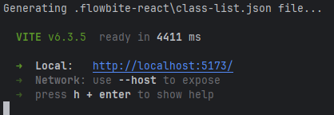

# <u>React + TypeScript + Vite Project </u>

This front-end project is a supplement to my-reserva-api, and together they form a full-stack application,
simulating an appointment/reservation handler app for small businesses such as doctors, salons, barber-shops etc.
In its current state, the app provides a basic reservation UI where a user can: 
- Create an account
- Login
- Logout
- Make a reservation
- View their current reservations 
- Cancel reservations

Admin accounts (controlled by the backend using and admin whitelist) can monitor user reservations and data, 
filtered by the selected date.

---
### API 

Backend (Node) Repo: https://github.com/CharioMich/my-reserva-api <br>

<b>UPDATE! (13/09/2025): The app can now run with an alternative fully compatible Spring Boot REST api.</b> <br>

Spring Backend Repo: https://github.com/CharioMich/my-reserva-spring-api


---

# <u> Run Instructions </u> 
Before anything else, make sure you have already cloned and set up the backend/api part following the instructions inside the 
corresponding repositories. 

To run the app:
- Clone the repo:
  ``` git clone git@github.com:CharioMich/myReserva-app.git ``` (SSH)
- In the root directory, in a terminal run ``` npm install ```
- In the root directory (where src lives), create a .env file ``` touch .env ```
- Inside the `.env` file copy-paste this: 
  ```
  VITE_API_URL=http://localhost:3000/api 
  ``` 
  to run the app with the Node 'my-reserva-api' 
  or:
  ```
  VITE_API_URL=http://localhost:8080/api 
  ``` 
  to run the app with the Spring Boot api.


- In a different terminal start the backend
- Run ``` npm run dev ``` or simply ``` vite ```
- Expected terminal outcome: <br>
  

---
### 📁 Project Structure (under src)
```
src/
├── api/             # API request logic (Axios instances, calling endpoints)
├── assets/          # Static assets (images, fonts, etc.)
├── components/      # UI components (buttons, forms, etc.)
├── context/         # React context providers for global state
├── hooks/           # Custom React hooks (e.g., useAuth)
├── pages/           # Route-level components (screens/views)
├── types/           # TypeScript type declarations and interfaces
├── utils/           # Utility/helper functions (cookie management)
│
├── App.css          # Component-specific/global styles
├── App.tsx          # Root component (typically holds layout and routes)
├── index.css        # Global/base styles 
├── main.tsx         # App entry point (renders <App /> to the DOM)
└── vite-env.d.ts    # Type declarations for Vite's environment variables
```

---

# <u> Technical Info </u>

- ## Forms
  Project's forms were implemented with states, zod validation and simple Flowbite components
  to demonstrate understanding of form handling and validation.
  The best alternative for a cleaner outcome would be a React Hook Form.

- ## Security

  During local development, HTTP is used for communication between the frontend and backend.

  In a real-world production deployment scenario, all data would be transferred securely over HTTPS.
  The app would be served on a domain, secured by an SSL/TLS certificate and HTTPS redirection would be enforced.
  Since this project is intended for local development and academic use, HTTPS was not implemented.


- ## Room for improvement...
  ### # 1 <br>
  After the expiry of access token, if no API call with axiosPrivate instance is made (ex. fetch reservations on Dashboard page),
  the token does not get refreshed. We could implement `getCurrentUser` with an axiosPrivate instance, but
  since axiosPrivate (useAxiosPrivate.ts) is using useAuth under the hood, when trying to call it or inject it in  useEffect of
  `AuthProvider.tsx` we get an error because no auth context has yet been initialized. Something like a chicken-and-egg problem. <br>
  getCurrentUser signature in `users.ts` file, would look something like this:
  
  ```js
  export const getCurrentUser = async (axiosPrivate: AxiosInstance) => {...}
  ```
  We would create the axiosInstance in the `AuthProvider.tsx` and inject it into the `getCurrentUser` function, but that's 
  not possible for the reason mentioned above. 
  
  ### # 2
  Flowbite's ` <NavbarLink> ` component does not support ` as={Link} ` prop, so we cannot use 
  React Router for faster navigation. Implementing custom ` <Link> ` elements would have been an
  alternative but due to restricted amount of time, default Flowbite's elements and ` href ` were used.

--- 

## <u>References</u>

Calendar PNG & Favicon: https://freesvgicons.com/search?q=calendar <br>
User SVG: https://www.svgrepo.com/ <br>
Detective dog image (403 page): https://puns.co/

---
Spotted an issue or a bug? Feel free to open a PR or reach out at: mpampisb@gmail.com 